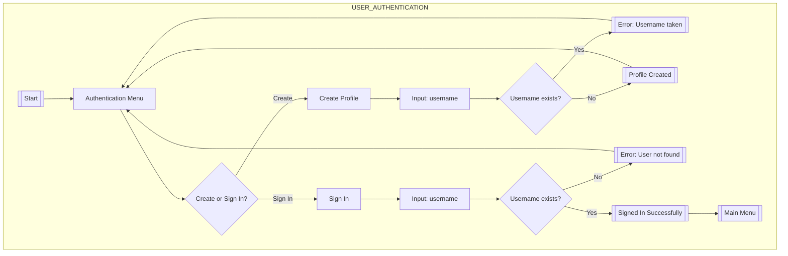
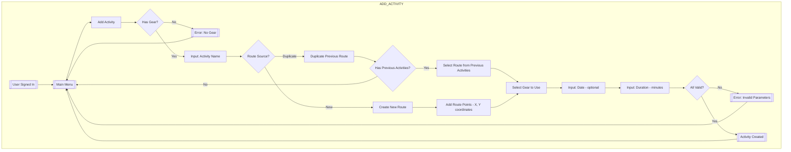
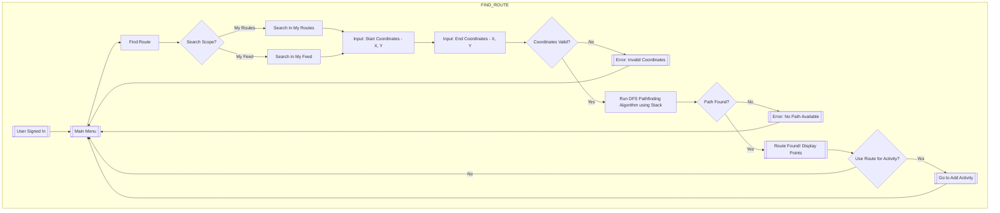
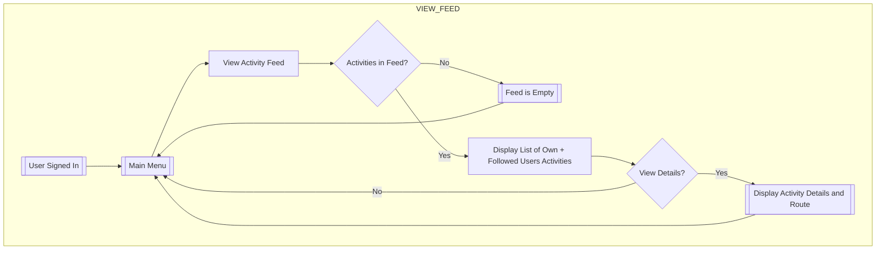
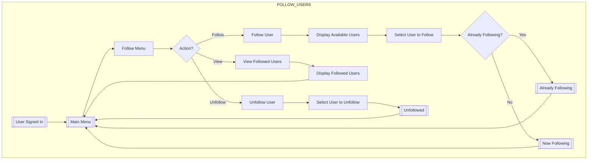
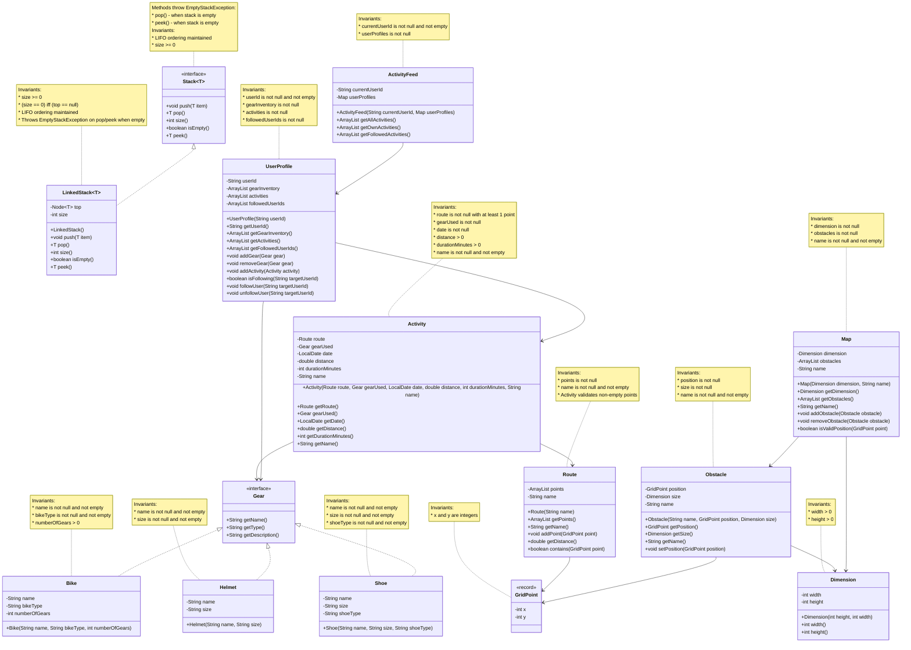

# CycleTracker - Phase 2: Multi-User Activity Tracking with Social Features

## Overview

CycleTracker Phase 2 extends the domain model from Phase 1 to support a multi-user cycling activity tracker with social networking features, intelligent route-finding, and proper layered architecture following SOLID principles.

### Key Features

* **Multi-user profiles**: Create accounts and sign in to access personalized activity tracking
* **Activity management**: Log cycling activities with routes, gear, and statistics
* **Social features**: Follow other users and view their activities in a unified feed
* **Route finding**: Discover new routes using depth-first search pathfinding algorithm based on existing routes
* **Gear management**: Manage personal cycling equipment (bikes, helmets, shoes)
* **Map management**: Track obstacles on a grid-based map system
* **Layered architecture**: Separation of concerns with UI, Logic, Model, and Exception layers

## Running the Application

The application can be started by running:
```bash
cd F:\git-projects\CycleTracker\CycleTracker
mvn clean compile exec:java -Dexec.mainClass="ca.umanitoba.cs.abdullmm.ui.MainRepl"
```

Or compile and run directly:
```bash
mvn clean package
java -cp target/classes ca.umanitoba.cs.abdullmm.ui.MainRepl
```

## Flows of Interaction

### Resources Consulted

* Java Collections Framework - ArrayList for managing collections
* Design patterns for layered architecture
* Guava preconditions for contract validation

### Diagrams

#### User Authentication and Profile Creation



#### Add Activity



#### Find Route with Pathfinding



#### View Activity Feed



#### Follow Users



## Domain Model

### Changes from Phase 1

1. **Added UserProfile class**: Represents a user's personal gear inventory, activity history, and followed users. Maintains invariants about non-null collections and valid user IDs.

2. **Added ActivityFeed class**: Aggregates activities from a user and all users they follow. Provides methods to retrieve own activities, followed activities, or all activities visible in the feed.

3. **Added Stack interface and LinkedStack implementation**: Required by Phase 2 specification for pathfinding algorithm. LinkedStack uses linked list structure with proper invariants.

4. **Refactored Route.getDistance()**: Changed return type from int to double for consistency with Activity distance tracking.

5. **Added Guava precondition checks**: Enhanced Shoe and Helmet classes with proper validation.

6. **Restructured package organization**: Separated code into ui, logic, model, and exceptions packages following layered architecture.

### Class Diagrams



## Layer Architecture

### Model Layer (ca.umanitoba.cs.abdullmm.model)
Represents the domain concepts. Validates class invariants.

* **GridPoint** (record): Represents a coordinate on the grid
* **Dimension**: Represents width and height
* **Route**: Collection of GridPoints forming a cycling route
* **Gear** (interface): Abstract cycling equipment
* **Bike, Helmet, Shoe**: Concrete gear implementations
* **Activity**: Records a completed cycling activity
* **Obstacle**: Represents an obstacle on the map
* **Map**: Grid-based world containing obstacles
* **UserProfile**: User's personal data, gear, and activities
* **ActivityFeed**: Aggregated view of activities from user and followed users
* **Stack<E>** (interface): Generic stack ADT
* **LinkedStack<E>**: Linked-list implementation of Stack

**Validation Strategy**: Class invariants checked at construction and after state changes using Guava preconditions.

### Logic Layer (ca.umanitoba.cs.abdullmm.logic)
Implements business rules and orchestrates model objects. Validates business preconditions and invariants.

* **UserManager**: Manages user profile creation, retrieval, and existence checks
* **ActivityManager**: Creates and retrieves activities, manages activity feed
* **PathFinder**: Implements pathfinding algorithm using Stack ADT with depth-first search

**Validation Strategy**: Business rule validation (duplicate users, invalid user references, activity constraints).

### UI Layer (ca.umanitoba.cs.abdullmm.ui)
Handles user interaction through REPL interface. Validates input format and type.

* **MainRepl**: Main menu system, user authentication flow, activity management flow, feed viewing, route finding interaction

**Validation Strategy**: Input format validation (string emptiness, numeric ranges, menu choices).

### Exceptions Layer (ca.umanitoba.cs.abdullmm.exceptions)
Custom exceptions for error handling across layers.

* **InvalidUserException**: User-related operation failures
* **DuplicateUserException**: Attempted creation of existing user
* **InvalidActivityException**: Activity creation or access failures
* **InvalidRouteException**: Route-related operation failures
* **PathNotFoundException**: Pathfinding algorithm failures

## Design Patterns and Principles

### SOLID Principles
* **Single Responsibility Principle**: Each class has one reason to change (UI handles I/O, Logic handles rules, Model handles state)
* **Open/Closed Principle**: Gear interface allows new gear types without modifying existing code
* **Liskov Substitution Principle**: Bike, Helmet, Shoe all properly implement Gear interface
* **Interface Segregation Principle**: Stack interface only includes required operations
* **Dependency Inversion**: MainRepl depends on manager abstractions, not direct model dependencies

### Design by Contract
* **Preconditions**: Input validation at layer boundaries (UI validates format, Logic validates business rules)
* **Postconditions**: State changes verified after operations
* **Invariants**: Class invariants checked using Guava Preconditions.check* methods

### Pathfinding Algorithm
Uses depth-first search (DFS) with a Stack ADT:
1. Initialize stack with start point
2. Track visited points to avoid cycles
3. For each point, explore unvisited adjacent points
4. When end point is reached, reconstruct path using parent pointers
5. If stack empty without finding end, no path exists

**Adjacency Definition**: Two grid points are adjacent if they differ by exactly 1 in either X or Y coordinate (not diagonally adjacent).

## Compilation and Testing

```bash
# Compile
mvn clean compile

# Run
mvn exec:java -Dexec.mainClass="ca.umanitoba.cs.abdullmm.ui.MainRepl"

# Or package and run
mvn clean package
java -cp target/classes ca.umanitoba.cs.abdullmm.ui.MainRepl
```

## Future Enhancements

* Persistent storage of user profiles and activities (database or file I/O)
* Visualization of routes and map on graphical interface
* Advanced pathfinding heuristics (Dijkstra's, A*)
* Activity statistics and analytics
* Achievements and badges system
* Export activities to external formats
