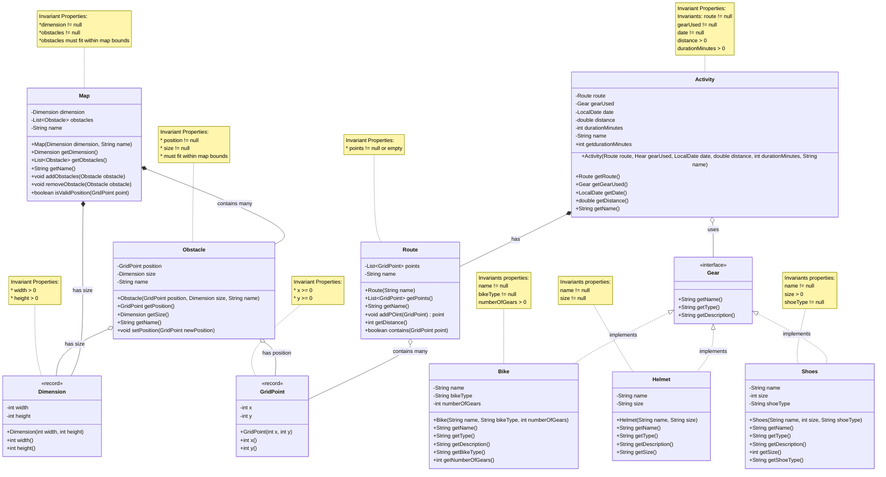

---
# Overview

CycleTracker is a cycling activity tracker built for COMP 2450 in Fall 2025.
CycleTracker enables cyclists to track their rides on a grid-based map system
with the following key features:

* Track cycling activities with detailed route information on a 2D grid map.
* Manage cycling gear including bikes, helmets, and shoes.
* Map obstacles that cyclists encounter during their routes (buildings, trees, etc.).
* Visualize routes and obstacles on an ASCII-based map display.
* Log activity statistics including distance and duration.

CycleTracker provides a foundation for route tracking and gear management,
with future plans to support multiple user profiles, social activity feeds, and
intelligent route-finding algorithms.

# Domain Model
